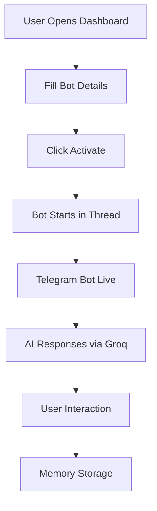

<div align="center">

<!-- Main Banner -->


🔱 TECHY ABHI 🔱

<h3>⚡ Advanced AI-Powered Telegram Bot Deployment System</h3>

<p>
  
  
  
  
  
</p>

<p>
  <a href="#deployment">🚀 Deploy Now</a> • 
  <a href="#features">✨ Features</a> • 
  <a href="#quick-start">⚡ Quick Start</a> • 
  <a href="#developer">👨‍💻 Developer</a>
</p>

</div>

---

📋 Table of Contents

· ✨ Features
· 🖼️ Screenshots
· ⚡ Quick Start
· 🚀 Deployment
· 🔧 Configuration
· 📁 Project Structure
· 💻 Usage
· 🎨 Customization
· 🔒 Security
· 🤝 Contributing
· 👨‍💻 Developer
· 📄 License

---

✨ Features

🎯 Core Features

Feature Description
🤖 Multi-Bot Support Run unlimited Telegram bots simultaneously
⚡ Instant Deployment Deploy bots in under 10 seconds
🧠 AI-Powered Groq's Llama 3.3 70B model
🎨 Custom Personalities Male/Female/Friendly/Professional styles
🌐 Web Dashboard Beautiful black & yellow themed interface
💾 Memory Management Context-aware conversation memory

🔧 Advanced Features

Feature Description
👑 Admin Control Panel Full moderation capabilities
📜 Dynamic Rules System Customizable group rules
🔄 Real-time Updates Live bot status monitoring
🛡️ Secure Architecture Token-based authentication
📱 Responsive Design Works on all devices
🌍 Multi-language Hinglish (Hindi+English) support

---

⚡ Quick Start

Prerequisites

```bash
✓ Python 3.8 or higher
✓ Telegram Bot Token (from @BotFather)
✓ Groq API Key (from console.groq.com)
✓ Basic terminal knowledge
```

Local Installation

```bash
# 1. Clone the repository
git clone https://github.com/abhi04110/TECHY-ABHI-Bot-Engine.git
cd TECHY-ABHI-Bot-Engine

# 2. Install dependencies
pip install -r requirements.txt

# 3. Set environment variables
export GROQ_API_KEY="your-groq-api-key"
export PORT=10000

# 4. Run the application
python main.py

# 5. Open browser and visit:
# http://localhost:10000
```

---

🚀 Deployment

Deploy on Render (Recommended)

https://img.shields.io/badge/Deploy%20on-Render-46a2f1?style=for-the-badge&logo=render

Steps:

1. Fork this repository
2. Sign up on Render.com
3. Create new Web Service
4. Connect your GitHub repository
5. Set environment variables:
   · GROQ_API_KEY: Your Groq API key
6. Deploy!

Deploy on Railway

https://railway.app/button.svg

Deploy on Heroku

```bash
# Create Heroku app
heroku create your-app-name

# Set environment variables
heroku config:set GROQ_API_KEY=your_key_here

# Deploy
git push heroku main
```

---

🔧 Configuration

Environment Variables

```env
# Required
GROQ_API_KEY=your_groq_api_key_here

# Optional (defaults shown)
PORT=10000
DEBUG=False
```

Bot Setup Steps

<div align="center">
  TECHY-ABHI-Bot-Engine
</div> 

1. Get Telegram Bot Token from @BotFather
2. Get Your Telegram ID from @userinfobot
3. Get Groq API Key from console.groq.com
4. Fill Details in dashboard
5. Activate and start chatting!

---

📁 Project Structure

```
TECHY-ABHI-Bot-Engine/
│
├── main.py                    # Main Flask application
├── requirements.txt           # Python dependencies
├── README.md                 # This documentation
├── Procfile                  # For Heroku/Render deployment
├── runtime.txt               # Python runtime version
│
├── assets/                   # Images and screenshots
│   ├── banner.png
│   ├── dashboard.png
│   ├── mobile-view.png
│   └── bot-chat.png
│
└── LICENSE                   # MIT License
```

---

💻 Usage

Bot Commands

```bash
🤖 BASIC COMMANDS:
/start    - Welcome message
/help     - All commands list
/rules    - Group rules
/me       - Bot info
/clear    - Clear chat memory

👑 ADMIN COMMANDS:
/kick     - Remove user
/mute     - Mute user
/unmute   - Unmute user
/spam     - Spam messages
/stop     - Stop spam
/del      - Delete message
```

How It Works



---

🎨 Customization

Modify Interface Theme

Edit CSS in main.py HTML_TEMPLATE section:

```css
/* Change Colors */
body {
    background: #000000;          /* Black background */
    color: #ffcc00;              /* Yellow text */
}

/* Modify Buttons */
.btn {
    background: #ffcc00;         /* Yellow button */
    color: #000000;              /* Black text */
}
```

Add New Features

1. New Commands: Add handlers in start_telegram_bot() function
2. AI Personality: Modify system prompt in get_ai_response()
3. UI Elements: Update HTML_TEMPLATE section

---

🔒 Security Features

Security Feature Status Description
🔐 Token Authentication ✅ Implemented Bot token validation
🛡️ Admin Protection ✅ Implemented Admin-only commands
🧹 Input Sanitization ✅ Implemented Prevents injection
🔒 Environment Variables ✅ Implemented Secure credential storage
📝 No Data Persistence ✅ Implemented Ephemeral memory only
⚡ Rate Limiting 🔧 Ready Can be implemented

---

🤝 Contributing

We welcome contributions! Follow these steps:

Development Setup

```bash
# 1. Fork the repository
# 2. Clone your fork
git clone https://github.com/YOUR_USERNAME/TECHY-ABHI-Bot-Engine.git

# 3. Create virtual environment
python -m venv venv

# 4. Activate virtual environment
# On Windows:
venv\Scripts\activate
# On Mac/Linux:
source venv/bin/activate

# 5. Install dependencies
pip install -r requirements.txt

# 6. Make your changes
# 7. Create Pull Request
```

Guidelines

· 🔧 Add tests for new features
· 📝 Update documentation
· 🎨 Follow existing code style
· 🐛 Report bugs via Issues
· 💡 Suggest features via Discussions

---

👨‍💻 Developer

<div align="center">

<h2>🔱 TECHY ABHI 🔱</h2>
<h3>Abhishek Saini | Full Stack Developer</h3>

<p>
  <a href="https://github.com/abhi04110">
    
  </a>
  <a href="https://abhiiport.netlify.app/">
    
  </a>
  <a href="https://youtube.com/@techyabhi04">
    
  </a>
  <a href="https://t.me/a6h1ii">
    
  </a>
  <a href="mailto:abhisheksaini32320@gmail.com">
    
  </a>
  <a href="https://t.me/abhi0w0">
    
  </a>
</p>

</div>

---

📄 License

```
MIT License

Copyright (c) 2024 TECHY ABHI

Permission is hereby granted, free of charge, to any person obtaining a copy
of this software and associated documentation files (the "Software"), to deal
in the Software without restriction, including without limitation the rights
to use, copy, modify, merge, publish, distribute, sublicense, and/or sell
copies of the Software, and to permit persons to whom the Software is
furnished to do so, subject to the following conditions:

The above copyright notice and this permission notice shall be included in all
copies or substantial portions of the Software.

THE SOFTWARE IS PROVIDED "AS IS", WITHOUT WARRANTY OF ANY KIND, EXPRESS OR
IMPLIED, INCLUDING BUT NOT LIMITED TO THE WARRANTIES OF MERCHANTABILITY,
FITNESS FOR A PARTICULAR PURPOSE AND NONINFRINGEMENT. IN NO EVENT SHALL THE
AUTHORS OR COPYRIGHT HOLDERS BE LIABLE FOR ANY CLAIM, DAMAGES OR OTHER
LIABILITY, WHETHER IN AN ACTION OF CONTRACT, TORT OR OTHERWISE, ARISING FROM,
OUT OF OR IN CONNECTION WITH THE SOFTWARE OR THE USE OR OTHER DEALINGS IN THE
SOFTWARE.
```

---

<h3>Made with ❤️ by <a href="https://t.me/a6h1ii">TECHY ABHI</a></h3>

<p>
  
</p>

</div>

---

🔗 Quick Links

· Live Demo - Try the dashboard
· Issues - Report bugs
· Discussions - Share ideas
· Telegram Channel - Updates & announcements
· Documentation Wiki - Detailed guides

---

<div align="center">

<hr>
<p align="center">
  <i>"Powering the next generation of AI Telegram bots"</i>
</p>

</div>
